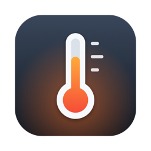

# MiniTherm

A small menu bar app for the **Mac mini with M6** (base model, `Mac18,5`): per-core CPU temperatures, GPU and SSD temperature, and fan control. Free and open source.


## What it does

- Hottest core temperature in the menu bar, with a 3-minute history graph in the panel
- Temperature and load for each of the 12 CPU cores (2 Super, 4 Performance, 6 Efficiency)
- GPU temperature (average of the GPU sensors) and SSD temperature
- Fan speed, with three modes:
  - **Auto** – macOS decides (default)
  - **Manual** – fixed RPM between the fan's minimum and maximum (1000–4900)
  - **Curve** – ramps linearly from minimum to maximum between two temperatures, following the hottest CPU core or the GPU, whichever is hotter
- Launch at login
- English and Turkish interface, following the system language

It only supports the base M6 Mac mini. On any other Mac it says so and shows nothing.

## Install

1. Download the zip from the [latest release](https://github.com/sadopc/MiniTherm/releases/latest) and unzip it.
2. Move `MiniTherm.app` to `/Applications`.
3. Open it. A thermometer and a temperature appear in the menu bar.

### "Apple could not verify MiniTherm…"

MiniTherm is not notarized: that requires a paid Apple Developer account, and this is a free hobby project. The build is only ad-hoc signed, so macOS blocks it the first time you open a downloaded copy. Use either of these once:

**System Settings**

1. Try to open MiniTherm and dismiss the warning with **Done** (not *Move to Trash*).
2. Open **System Settings → Privacy & Security** and scroll down to **Security**.
3. Next to "MiniTherm was blocked…", click **Open Anyway** and confirm with your password.

**Terminal**

```sh
xattr -dr com.apple.quarantine /Applications/MiniTherm.app
```

This removes the "downloaded from the internet" flag that triggers the check. If you would rather not trust a prebuilt binary, build it yourself (below) – a locally built app is never blocked.

## Resource usage

Measured on a Mac mini M6 (macOS 27.0.1), panel closed, fan mode Auto:

| | |
|---|---|
| CPU | about 0.14% of one core (0.13 s of CPU time per 90 s) |
| Memory | 18 MB shortly after launch |
| App size | about 0.5 MB |
| Fan helper | no CPU while idle, 5.8 MB memory |

Sensors are sampled every 2 seconds (about 0.4 ms of CPU per sample). The interface is only redrawn while the panel is open, or when the number in the menu bar changes; redrawing on every sample used to cost about 1.2% of one core. Usage with the panel open, or in Manual/Curve mode (where the helper receives a command every 2 seconds), has not been measured.

## Build and run

Requires Xcode (or the Swift toolchain) on macOS 14 or later.

```sh
./build.sh
open build/MiniTherm.app
```

Copy `build/MiniTherm.app` to `/Applications` if you want to keep it (do this before turning on *Launch at login*).

## Fan control and the root helper

Reading sensors needs no special rights. Writing fan speed does: the SMC only accepts writes from root. The first time you click **Enable…** in the fan section, the app asks for an administrator password and installs a small daemon (`local.minitherm.helper`) that does nothing except set the fan speed or hand it back to macOS.

The daemon returns the fan to automatic control when

- the app quits or crashes,
- it has not heard from the app for 20 seconds, or
- any CPU or GPU sensor reaches 100 °C.

It accepts connections only from root and the user logged in at the console, and clamps every request to the fan's own limits.

To remove it:

```sh
sudo ./uninstall-helper.sh
```

## How the sensors were found

Apple does not document the SMC keys, and they change with every chip generation. The map in [`SensorMap.swift`](Sources/MiniThermKit/SensorMap.swift) was found by measurement on a Mac mini M6 running macOS 27.0.1.

macOS has no CPU affinity on Apple Silicon, so a thread cannot be pinned to a core. Instead, a set of threads each check which core they are currently on and only run a heavy workload while they are on the target core, sleeping otherwise. Heating one core at a time this way and watching which key rises gives:

| Core | Logical CPU | Primary key | Secondary key |
|---|---|---|---|
| S1 | cpu6 | `Tp0g` | `Tp07` |
| S2 | cpu7 | `Tp0j` | `Tp09` |
| P1 | cpu8 | `Tp0L` | `Tp0G` |
| P2 | cpu9 | `Tp0I` | `Tp0E` |
| P3 | cpu10 | `Tp0d` | `Tp05` |
| P4 | cpu11 | `Tp0m` | `Tp0b` |
| E2 | cpu1 | `Te07` | – |
| E3 | cpu2 | `Te08` | – |
| E4 | cpu3 | `Te09` | – |
| E1, E5, E6 | cpu0, cpu4, cpu5 | none found | – |

Known limits:

- **Three efficiency cores have no sensor of their own.** In repeated measurements no key responded specifically to cpu0, cpu4 or cpu5. The app shows the average of the three efficiency sensors for them, marked with `≈`.

### GPU and SSD

Both were checked by loading one component at a time while logging every temperature key, with CPU load staying at about 5%.

| Test | Keys that responded | Everything else |
|---|---|---|
| Metal compute load, 35 s | all 18 `Tg*` keys rose 21–25 °C (30 → 53–58 °C) | CPU core sensors rose 13–18 °C from heat spreading across the chip |
| Disk writes, 64 GB in 40 s | `TN00` rose 10 °C (33 → 45 °C) | all other sensors rose 2–3.5 °C |

- **GPU** is the average of the 18 `Tg*` keys. They read almost identically at idle and spread by about 5 °C under load.
- **SSD** is `TN00`. The `TH0a`/`TH0b`/`TH0x` keys, which tools for earlier Apple Silicon use for the SSD, rose only 2–3.5 °C in the same test, so they are not used here. `TN01` reads 0 on the base model.

Fan control on this machine is `F0md = 1` followed by `F0Tg = <rpm>` (both need root); `F0md = 0` returns to automatic. No `Ftst` unlock is needed.

## Disclaimer

This uses undocumented interfaces that Apple can change in any macOS update. Running a fan too slowly under load makes the machine throttle or shut down to protect itself. Use at your own risk.

## Icon

The icon is drawn in code: `swift scripts/make-icon.swift icon.png` writes the 1024×1024 source for `Resources/AppIcon.icns`.

## License

MIT – see [LICENSE](LICENSE).
