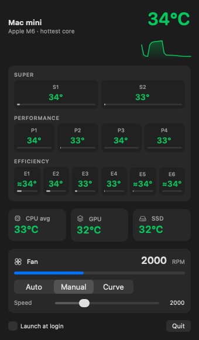

# CoreTemp

A small menu bar app for the **Mac mini with M6** (base model, `Mac18,5`): per-core CPU temperatures, GPU and SSD temperature, and fan control. Free and open source.



## What it does

- Hottest core temperature in the menu bar, with a 3-minute history graph in the panel
- Temperature and load for each of the 12 CPU cores (2 Super, 4 Performance, 6 Efficiency)
- GPU temperature (average of the GPU sensors) and SSD temperature
- Fan speed, with three modes:
  - **Auto** – macOS decides (default)
  - **Manual** – fixed RPM between the fan's minimum and maximum (1000–4900)
  - **Curve** – ramps linearly from minimum to maximum between two temperatures of the hottest core
- Launch at login
- English and Turkish interface, following the system language

It only supports the base M6 Mac mini. On any other Mac it says so and shows nothing.

## Build and run

Requires Xcode (or the Swift toolchain) on macOS 14 or later.

```sh
./build.sh
open build/CoreTemp.app
```

Copy `build/CoreTemp.app` to `/Applications` if you want to keep it (do this before turning on *Launch at login*).

## Fan control and the root helper

Reading sensors needs no special rights. Writing fan speed does: the SMC only accepts writes from root. The first time you click **Enable…** in the fan section, the app asks for an administrator password and installs a small daemon (`local.coretemp.helper`) that does nothing except set the fan speed or hand it back to macOS.

The daemon returns the fan to automatic control when

- the app quits or crashes,
- it has not heard from the app for 20 seconds, or
- any CPU sensor reaches 100 °C.

It accepts connections only from root and the user logged in at the console, and clamps every request to the fan's own limits.

To remove it:

```sh
sudo ./uninstall-helper.sh
```

## How the sensors were found

Apple does not document the SMC keys, and they change with every chip generation. The map in [`SensorMap.swift`](Sources/CoreTempKit/SensorMap.swift) was found by measurement on a Mac mini M6 running macOS 27.0.1.

macOS has no CPU affinity on Apple Silicon, so a thread cannot be pinned to a core. Instead, a set of threads each check which core they are currently on and only run a heavy workload while they are on the target core, sleeping otherwise. Heating one core at a time this way and watching which key rises gives:

| Core | Logical CPU | Primary key | Secondary key |
|---|---|---|---|
| S1 | cpu6 | `Tp0g` | `Tp07` |
| S2 | cpu7 | `Tp0j` | `Tp09` |
| P1 | cpu8 | `Tp0L` | `Tp0G` |
| P2 | cpu9 | `Tp0I` | `Tp0E` |
| P3 | cpu10 | `Tp0d` | `Tp05` |
| P4 | cpu11 | `Tp0m` | `Tp0b` |
| E2 | cpu1 | `Te07` | – |
| E3 | cpu2 | `Te08` | – |
| E4 | cpu3 | `Te09` | – |
| E1, E5, E6 | cpu0, cpu4, cpu5 | none found | – |

Known limits:

- **Three efficiency cores have no sensor of their own.** In repeated measurements no key responded specifically to cpu0, cpu4 or cpu5. The app shows the average of the three efficiency sensors for them, marked with `≈`.
- The GPU value is the average of the 18 `Tg*` keys. It was only observed at idle.
- The SSD value uses `TH0a`/`TH0b`/`TH0x`, following the naming on earlier Apple Silicon; it was not verified by loading the disk.

Fan control on this machine is `F0md = 1` followed by `F0Tg = <rpm>` (both need root); `F0md = 0` returns to automatic. No `Ftst` unlock is needed.

## Disclaimer

This uses undocumented interfaces that Apple can change in any macOS update. Running a fan too slowly under load makes the machine throttle or shut down to protect itself. Use at your own risk.

## License

MIT – see [LICENSE](LICENSE).
